# Using code-review-dev

`/code-review-dev` turns a diff into one HTML page you review in the browser,
in three steps:

1. **Overview**: what the change does for the people using the product, a few
   things to confirm about it, and how it rearranges the code.
2. **Code**: the diff, file by file, in a sensible reading order. You tick off
   what you've seen and leave comments.
3. **Submit**: your summary, verdict, comments and feature concerns, posted to
   the PR as one review.

The header's **Overview / Code / Submit** tabs (or keys `1`, `2`, `3`) move
between steps at any time.

The screenshots below come from a made-up PR: a library app that starts
charging late fees on overdue loans.

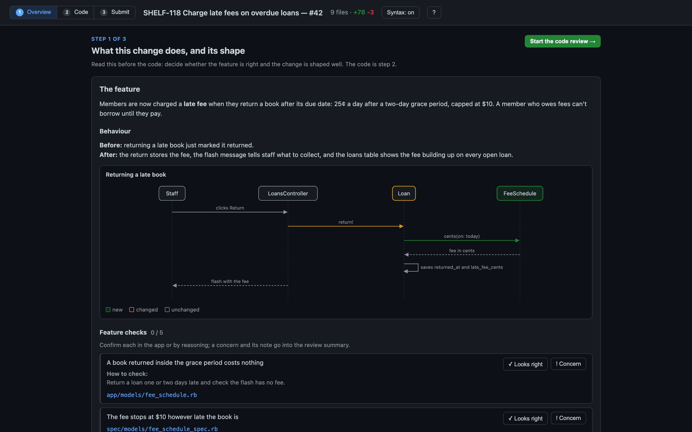

## Start a review

Ask Claude in plain words:

```
/code-review-dev PR #123
/code-review-dev SHELF-118
/code-review-dev a1b2c3d
/code-review-dev main..my-branch
/code-review-dev re-review PR #123
```

Claude finds the diff and the PR, reads the change, writes the overview and a
reading guide, and opens the page. With a PR, the page runs on a local server
so it can post your review; without one, it opens as a plain file and you copy
your comments out.

The first time you run it, Claude asks four questions about how you like to
review (file order, where tests go, how much to auto-review, which comments to
suggest). It saves your answers to `~/.claude/code-review-dev/preferences.md`;
edit that file at any time. A repo can add its own rules in
`.claude/code-review-dev.md`.

## Step 1: Start with the overview

The page opens on the overview. Read it before the code: it should tell you
whether the feature is right and whether the change is well shaped, so the code
becomes the place you confirm that. (Next time you open the page, it returns to
whichever step you were on.)

### The feature

Claude explains what someone using the product can now do, and walks through
the behavior before and after. It takes this from the ticket or PR, then checks
it against the diff. If the code does more, less, or something different from
what the ticket asks, the overview says so. Diagrams appear where they explain
a flow faster than prose.

### Feature checks

Below the feature is a short list of behavior worth confirming: edge cases,
neighboring features, and anything the ticket asked for that Claude couldn't
find in the diff. Each check can say how to verify it and link to the file
involved. Mark each one **Looks right** or **Concern**. A concern opens a note
box for what's wrong.

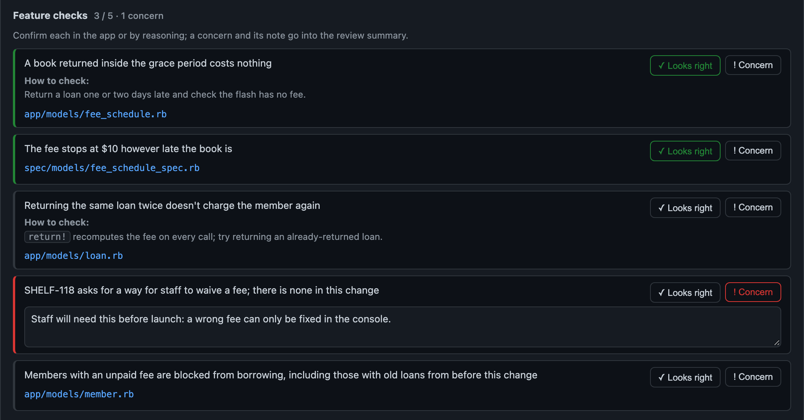

Concerns and their notes go into your review summary when you submit, so you
don't have to rewrite them as comments.

### The shape of the change

The shape covers the structure of the change: which layers and objects it
touches, any new dependencies, and anywhere it breaks the project's
architecture rules. Departures show in a yellow box. New parts are green,
changed parts amber, removed parts red.

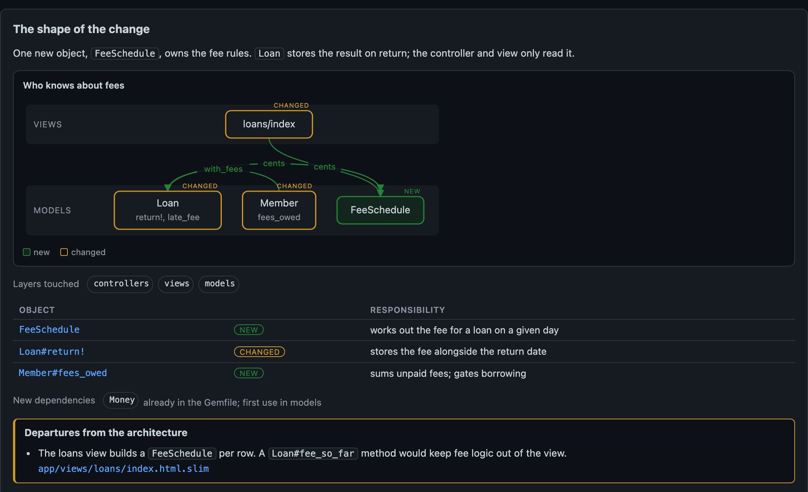

Under that, the page adds two blocks it works out from git itself: **Where the
change lands** (lines changed per area of the codebase) and **How the
codebase's shape moved** (each touched file's length before and after, sorted
by growth). A file that crosses 400 lines gets a badge. If a file doubles in
size, Claude's note above the table should say whether that's fine.

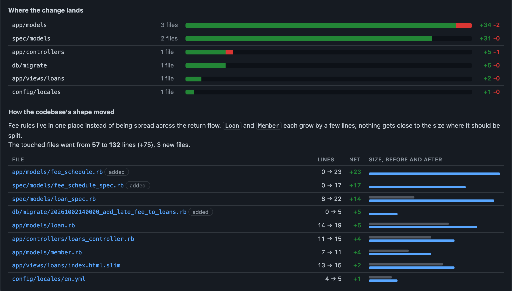

Click **Start the code review** when you're done.

## Step 2: Review the code

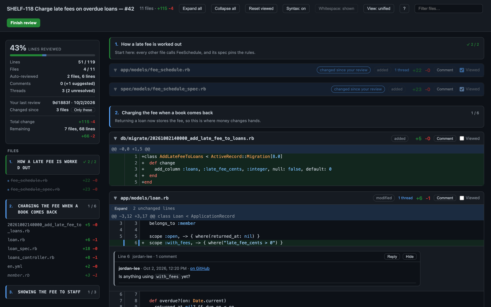

### Track your progress

The sidebar counts how much of the change you've read in lines, not files, so
a one-line file doesn't count the same as a 300-line one. Tick **Viewed** on a
file to count it. Auto-reviewed lines fill the bar in a second color, so you
can see how much you're trusting Claude on.

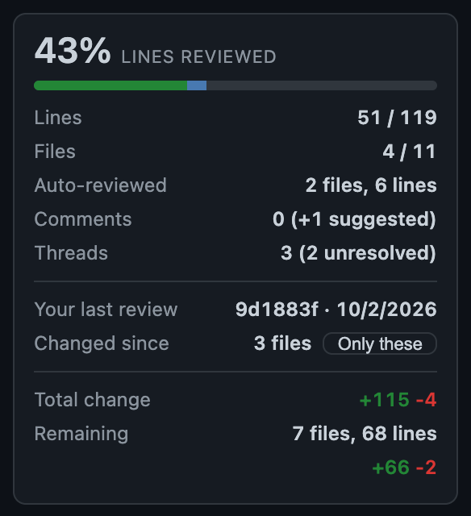

### Read in a sensible order

Claude sorts the files into groups and puts them in the order that makes the
change easiest to follow: the group that explains the change first, mechanical
fallout last. Each group says why you read it at that point. Files you've
marked Viewed are struck through, and a finished group turns green.

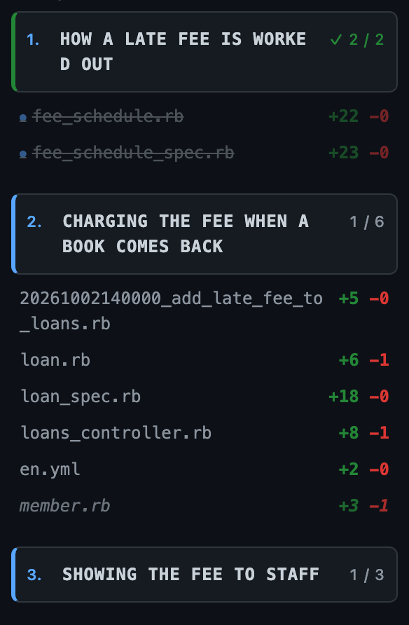

No file can drop out: any file the guide misses still shows, in an "Unsorted"
group at the end.

When part of the change is hard to follow from the code alone, Claude can pin a
diagram to that group, so it shows right above the files it explains.

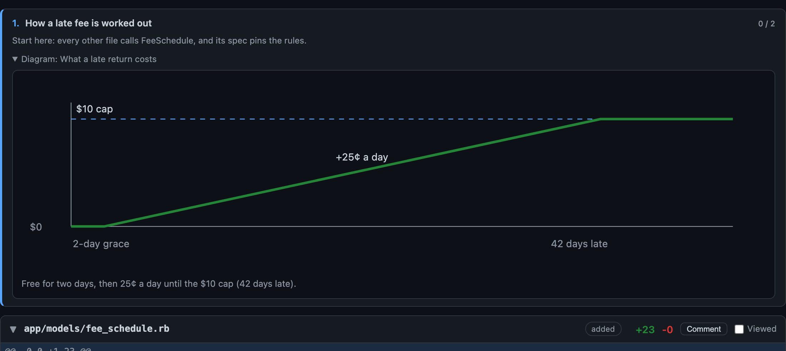

### Skip the trivial files, safely

Small changes unrelated to the point of the PR (a renamed constant, a typo fix)
can be auto-reviewed. Claude reads the whole diff, judges it fine, and writes
one line on what changed. The file stays in its group, collapsed under a dashed
border. Expand it to check Claude's work, or tick Viewed to sign it off
yourself.

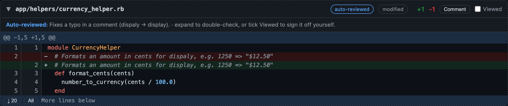

Claude never auto-reviews config, migrations, routes, auth, or a file it would
comment on.

### See the conversation so far

The PR's review threads show inline at their lines, with replies, authors, and
a link to each one on GitHub. Resolved threads start collapsed. **Reply**
drafts a reply that goes out with your review.

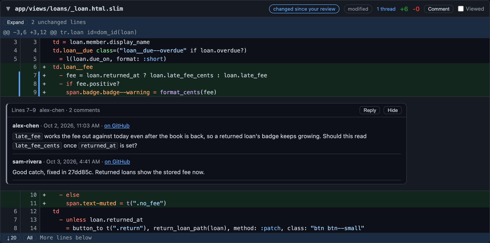

### Comment like on GitHub

Click a line number to comment on it, or drag across line numbers to comment on
a range. Each file header has a **Comment** button for a comment on the whole
file. The editor takes Markdown, has a Preview tab, and lets you paste or drop
attachments. **Suggest** fills in a `suggestion` block from the lines you
picked, ready to edit.

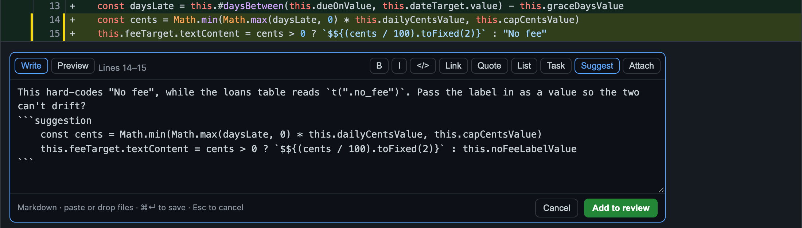

Saved comments show the suggested change as a diff, as GitHub will.

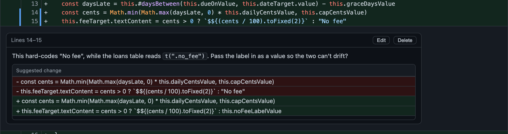

### Accept or dismiss Claude's suggestions

Claude can draft comments for you, by default only for real bugs and risks.
They show with a dashed border and a **Suggested** badge, and stay out of your
review until you click **Accept** (or **Edit**). **Dismiss** removes one for
good.

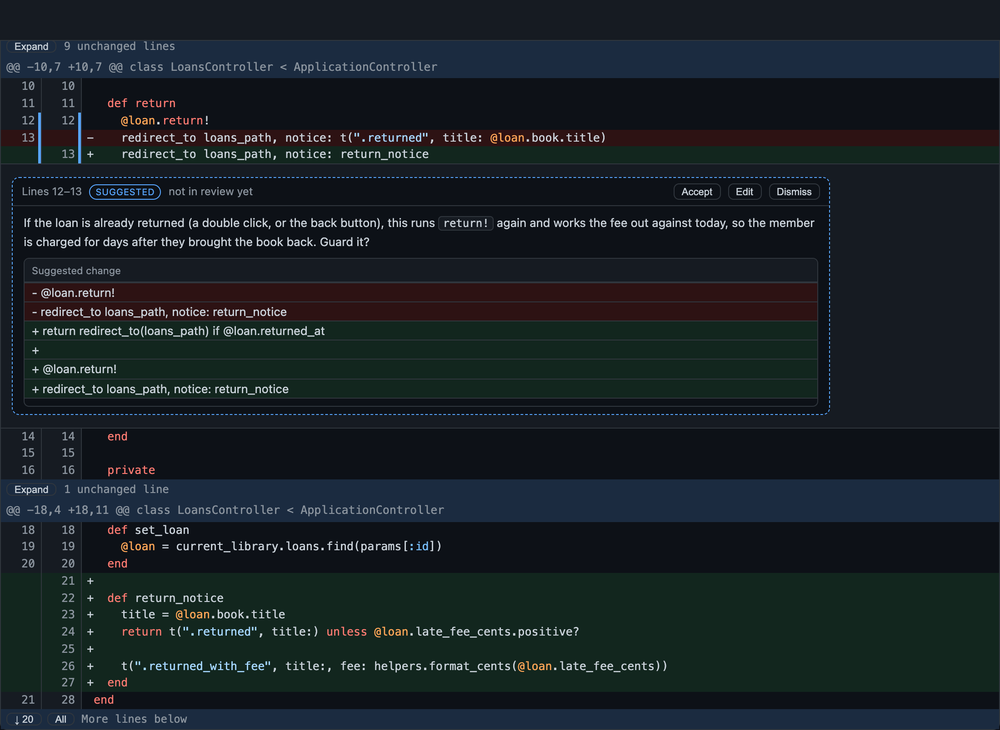

### Split view

**View: unified / split** puts the old and new file side by side. Comments,
threads, and range selection work the same in both views, and the page
remembers your choice.

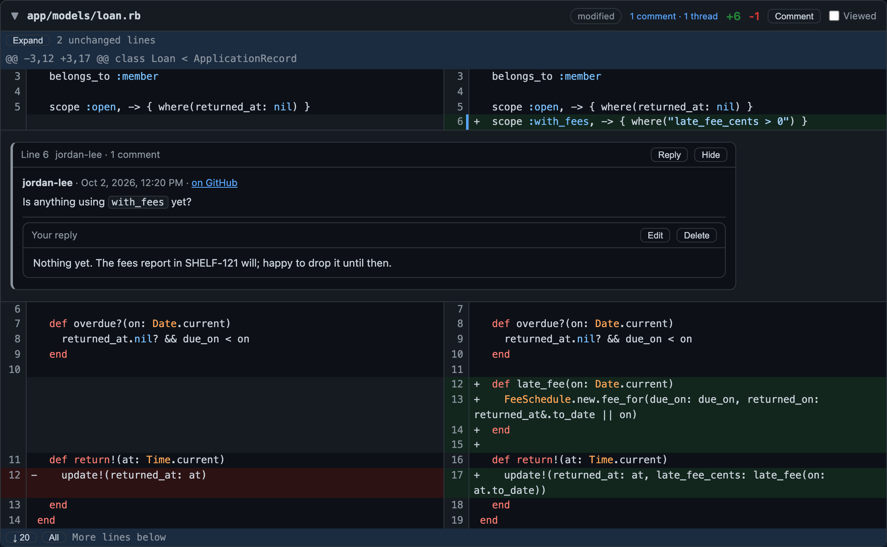

## Step 3: Finish and submit

**Finish review** (or the **Submit** tab) opens the submit page. It lists every
comment and reply with its code, any suggestions you haven't decided on, and
the auto-reviewed files. Write a summary, pick Comment, Approve, or Request
changes, and click **Submit review** to post it all to the PR as one review.

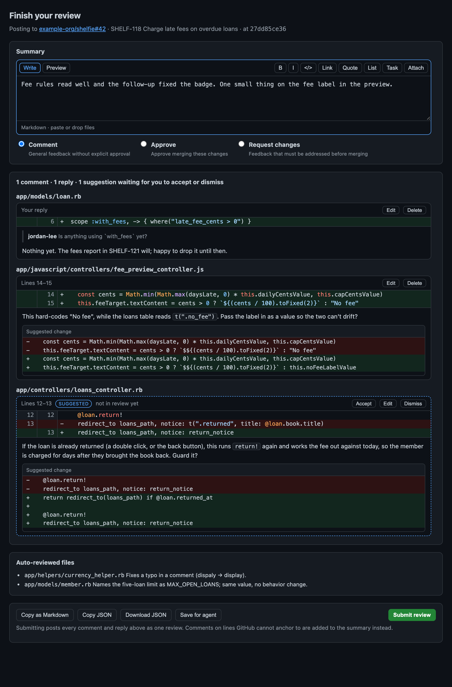

The page also shows where your feature checks stand. If any are still open, a
link takes you back to the overview. Each concern and its note is added to the
end of your summary as a **Feature concerns** list.

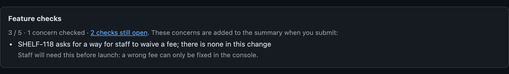

If GitHub can't attach a comment to its line, the comment moves into the review
summary instead of making the whole review fail. Without a PR, **Copy as
Markdown** gives you the review to paste anywhere. **Save for agent** writes
it to disk so Claude can act on your comments.

GitHub has no API for uploading attachments. When you submit, the page saves
them to disk and tells you which ones to drag into the review on GitHub.

Once the review is posted, the page says so and links to it.

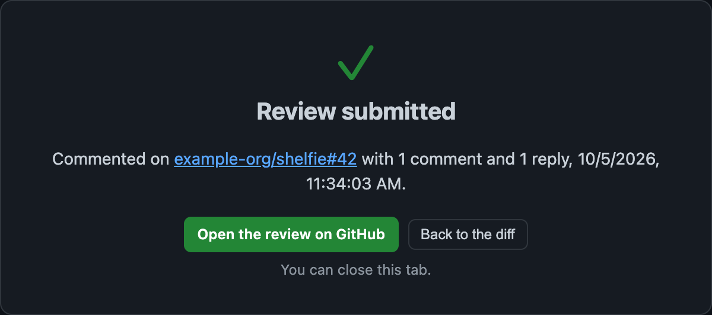

## Re-review

Ask Claude to re-review a PR you've reviewed before. Files that changed since
your last review get a **changed since your review** badge, and **Only these**
in the sidebar filters down to them. Or ask for a page with only the new
commits. Your drafts and Viewed ticks carry over; a tick clears itself when its
file changes.

## Keyboard

| Key | Action |
|-----|--------|
| `1` / `2` / `3` | Overview / Code / Submit |
| `j` / `k` | Next / previous file |
| `v` | Toggle Viewed |
| `x` | Collapse file |
| `n` / `p` | Next / previous comment or thread |
| `/` | Filter files |
| `s` | Split / unified view |
| `w` | Show / hide whitespace changes |
| `?` | Help |
